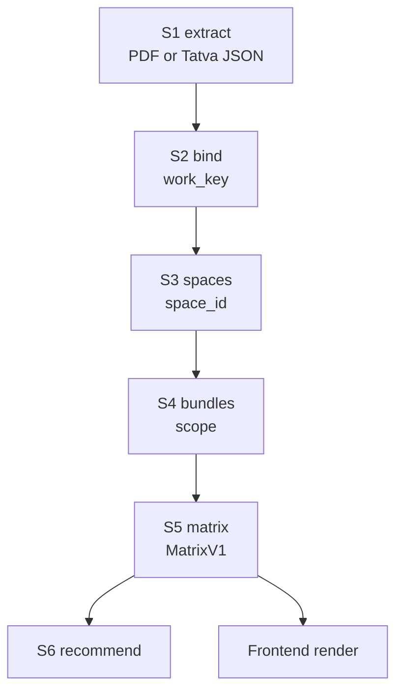

# QuoteSense comparison pipeline — plan index and change protocol

This is the spine document for the quote-comparison pipeline. It defines the
stages, the data contract that flows between them, and the rule you follow when
something breaks so that you change **only the stage that broke**.

Read this first, then open the stage file you actually need.

**Do not reverse** the customer-facing invariants in [ACTION.md](ACTION.md):
one physical room is one matrix section (Living / L R / LVR / L ROOM are the
same space), a single-item lumpsum is never a mixed package, and an expired
session is a login popup rather than an inline button.

| Where | File | Covers |
| --- | --- | --- |
| Root | `PLAN.md` (this file) | Stage map, contract chain, change protocol |
| Backend | [backend/PLAN.md](backend/PLAN.md) | Backend stage index |
| Backend | [backend/docs/plan/00-contracts.md](backend/docs/plan/00-contracts.md) | Field-level contract definitions |
| Backend | `backend/docs/plan/01-extract.md` … `06-recommend.md` | One file per stage |
| Frontend | [frontend/PLAN.md](frontend/PLAN.md) | Frontend stage index |
| Frontend | `frontend/docs/plan/00-contracts.md` … `04-export.md` | One file per stage |

---

## 1. Why this exists

The comparison matrix grouped rows incorrectly. Three separate root causes,
all visible in a real two-quote comparison (`Q2OE1CX` vs `QGT3A1I`):

1. **Work items that are the same were split into different rows.** The join key
   was the raw vendor string, so `Side table` and `Side Table` did not match.
2. **Spaces that are the same were split, and item names became fake spaces.**
   A line whose Space/Zone was `Used cloth unit` became its own space, even
   though its description said "MBR Used cloth storages".
3. **A lumpsum from one vendor was never compared against the itemised lines of
   another.** One vendor's `Hardwares` at Rs 1,00,300 and the other's five
   itemised accessory lines totalling Rs 37,198 never appeared side by side.

Fixing these needs changes in five different places. Without a contract between
them, every future model change (a new extraction model, a new taxonomy, a new
vendor payload shape) risks breaking the whole chain. Hence the contract.

---

## 2. Stage map



| Stage | Owner module | Responsibility |
| --- | --- | --- |
| S1 extract | `backend/services/extractor.py`, `comparator.mongodb_quotes_to_dataframe` | Get line items out of a PDF or Tatva payload |
| S2 bind | `backend/services/work_catalog.py`, `comparator._bind_catalog_ids_from_cache` | Decide **what work** each line is |
| S3 spaces | `backend/services/space_clusters.py` | Decide **which room** each line belongs to |
| S4 bundles | `backend/services/bundles.py` | Decide **how wide** each line's price reaches |
| S5 matrix | `backend/services/comparator.py` | Pivot into space / bundle / project tiers |
| S6 recommend | `backend/services/comparator.py` | Narrate the matrix |

The three middle stages answer three independent questions. Keeping them
independent is the whole point: a bad space guess must not corrupt the work key,
and a bad work key must not corrupt the bundle detection.

---

## 3. The contract chain

Each stage receives a row dict (a pandas DataFrame row) and returns the same row
with **more** fields. No stage removes or rewrites a field owned by an earlier
stage.

```
S1 emits  LineItemV1
S2 adds   work_key, work_label, work_confidence, work_source
S3 adds   space_id, space, space_confidence, space_source
S4 adds   scope, bundle_id, bundle_label, covered_space_ids,
          covered_work_keys, overlap_flags
S5 emits  MatrixV1
```

Field-by-field definitions live in
[backend/docs/plan/00-contracts.md](backend/docs/plan/00-contracts.md). That file
is the single source of truth; this one is the map.

### Ownership rule

Every field has exactly one owning stage. Only the owner writes it.

| Field prefix | Owner |
| --- | --- |
| `vendor_*`, `amount`, `rate`, `quantity`, `pricing_method`, `sub_service`, `item_name`, `description`, `space_raw` | S1 |
| `work_*`, `sub_service_id`, `pricing_method_id` | S2 |
| `space*` (except `space_raw`) | S3 |
| `scope`, `bundle_*`, `covered_*`, `overlap_flags` | S4 |

If you find yourself wanting to write another stage's field, you have found a
design problem, not a shortcut.

---

## 4. Change protocol

This is the part that matters when a model changes tomorrow.

### Adding a field

Additive changes are always safe. Add the field, document it in `00-contracts.md`
under its owning stage, leave the contract version alone. Downstream stages
ignore fields they do not know about.

### Removing or renaming a field

1. Bump the contract version in `00-contracts.md` (`LineItemV1` → `LineItemV2`).
2. Update the owning stage's doc.
3. Grep for the field name and update every reader.
4. Run the golden fixture tests. They will tell you exactly which stage broke.

### When a stage breaks

Do not read the whole pipeline. Do this instead:

1. Run `pytest backend/tests/test_matrix_contract.py`. It validates the row
   contract **between** each stage and names the first stage whose output is
   malformed.
2. Open that stage's doc. Each one ends with a "What to change if this stage
   breaks" section.
3. Fix inside that stage only. If the fix requires a field from another stage
   that does not exist yet, that is a contract change — follow the section above.

### When the extraction model changes

Only S1 changes. Its job is to produce a valid `LineItemV1` regardless of which
model or payload shape produced it. If the new model returns a different JSON
shape, adapt it inside `01-extract.md`'s adapter. S2 through S6 must not need an
edit — if they do, S1 is not honouring its contract.

### When the taxonomy changes

Only S2 changes. `work_key` values come from `backend/models/taxanomy.py`. New
sub-services mean new alias entries, not new pipeline logic.

---

## 5. Kill switches

Every LLM-assisted step degrades to a deterministic heuristic. Set these to `0`
to force fully reproducible behaviour (the test suite does exactly this).

| Env var | Default | Disables |
| --- | --- | --- |
| `GEMINI_WORK_LLM` | `1` | S2 leftover work-label resolution |
| `GEMINI_SPACE_LLM` | `1` | S3 space cluster refinement |

Neither switch changes the output *contract* — only the quality of the guesses.

---

## 6. Golden fixtures

`backend/tests/fixtures/` holds two real anonymised quotes and the expected
matrix. They are the regression net for every change described here. If a change
alters the golden output, that is either a bug or a deliberate improvement — and
in the second case you update the fixture in the same commit, never separately.

---

## 7. Keeping the graph current

After changing any backend or frontend source file:

```bash
graphify update .
```
