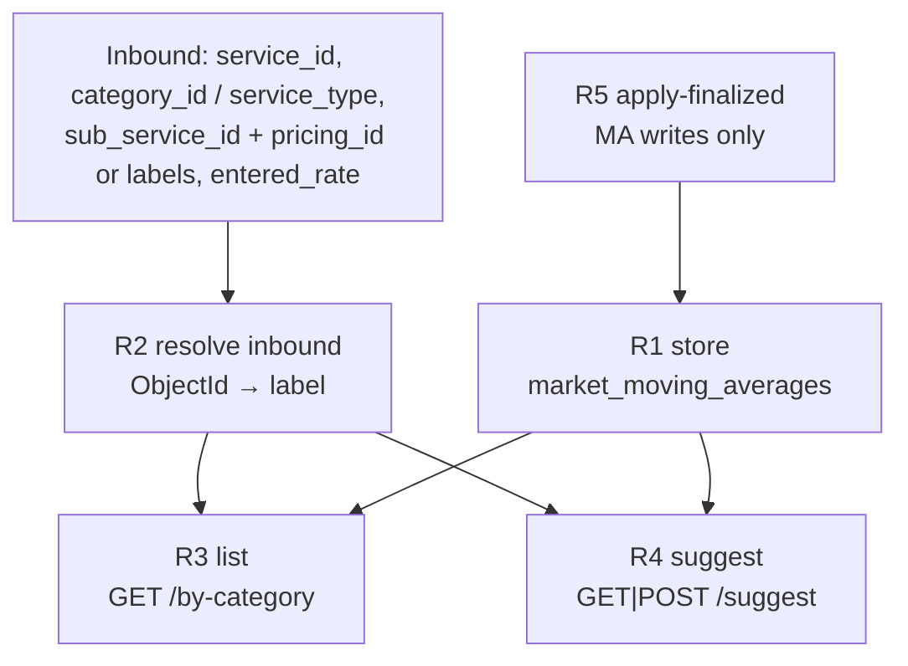

# QuoteSense vendor recommendations — plan index and change protocol

This is the spine document for **vendor market-rate recommendations** (the
PM quote form: bulk bases + above-base suggestion).

Comparison is a different product. Its map is [PLAN.md](PLAN.md). Its lock
is [ACTION.md](ACTION.md). This file's lock is
[ACTION_RECOMMENDATIONS.md](ACTION_RECOMMENDATIONS.md) — do not reverse
§1–4.

`backend/docs/plan/06-recommend.md` is comparison S6 (matrix narrative).
It is **not** this flow. Do not edit comparison S6 to change vendor base
rates, and do not edit this flow to change the comparison report.

PM HTTP examples live in [docs/VENDOR_MARKET_RATE_API_PM.md](docs/VENDOR_MARKET_RATE_API_PM.md).
This file is the agent map: which step owns which behaviour so a later task
changes **only the step that broke**.

---

## 1. Why this exists

Vendor forms need a recommended base rate per work item + pricing method,
with Tatva ObjectIds the form can match locally.

A live-catalog overlay used to replace those ids (Area → inactive Square
Feet; Loft & Door Type → Loft). That is fixed. The working contract is:
**Supabase `market_moving_averages` is the single source for ids and
rates on the way out.**

Later tasks must not reopen that path.

---

## 2. Stage map

| Stage | Owner module | Responsibility |
| --- | --- | --- |
| R1 store | Supabase `market_moving_averages`; seed SQL is labels + rates only | Persist base rate, weight, and env ObjectIds |
| R2 resolve | `backend/services/tatva_catalog.py` (`resolve_item_labels`), `main.py` `_resolve_work_item_labels` | Inbound ids → labels so R4 can look up the bundle. Reverse-map via MA columns + `_PM_STALE_ID_ALIASES`. Not used to overwrite outbound ids |
| R3 list | `market_rate.list_market_rates_by_category`, `GET /api/market-rate/by-category` | All recommendable rows for one service + tier. Ids from MA columns only |
| R4 suggest | `market_rate.recommend_rate`, `GET\|POST /api/market-rate/suggest` (`/lookup`, `/recommend`) | One bundle. Banner only when entered rate > base |
| R5 apply | `market_rate.update_rates_from_dataframe`, `POST /api/market-rate/apply-finalized` | Finalized quotes blend existing MA rows, or INSERT a new combo for **that tier only** when the line has Tatva `sub_service_id` + `pricing_method_id`. Gated by `MARKET_RATE_UPDATES_ENABLED`. Compare never writes MA |

Entry points: `backend/main.py` (`/api/market-rate/*`). Tests:
`backend/tests/test_market_rate_helpers.py`,
`backend/tests/test_tatva_catalog_helpers.py`.

---

## 3. Contract (fields this product owns)

Outbound item (R3 list row and R4 suggest when a row exists):

| Field | Source | Notes |
| --- | --- | --- |
| `service_id` | MA `service_id` | Interiors is `6926b1978ba6a3cfc5a191ce` on every env |
| `sub_service_id` | MA `sub_service_id` | Env-specific. Null if that column is empty |
| `sub_service_label` | MA `sub_service` | Display / label lookup |
| `pricing_id` | MA `pricing_method_id` | Response name is `pricing_id`. Env-specific |
| `pricing_method_label` | MA `pricing_method` | Display / label lookup |
| `market_rate` | MA `rate_moving_average` (fallback `moving_average`) | Rounded to 2 dp |
| `weight` | MA `weight` | Seed/prod interiors use ≥ 1 so first finalize blends |
| `suggestion` | `_base_rate_message` | Copy on list rows; banner still follows R4 |
| `recommend` | R4 only | `true` only when entered_rate > base |
| `verdict` / `message` | R4 when high | `ABOVE_MARKET_MESSAGE` |

Bundle lookup key (exact, label-based after R2):

`service_type` + `service_category` + `sub_service` + `pricing_method`

Inbound params: `service_id` (main service), `category_id` /
`quote_type_id` (Essential / Mid / Luxury quotation type), optional
`service_type` string. Do not treat `category_id` as a sub-service id.

### Ownership rule

| Field | Owner |
| --- | --- |
| Outbound ObjectIds and rates | R1 via R3/R4 copy (`_label_ids`) |
| Inbound id → label | R2 |
| `recommend` / banner | R4 |
| MA rate blend / new-combo insert | R5 only |

R3/R4 must not write R2's live catalog into outbound ids. R5 must not run
from a compare session. R5 inserts only the finalized quote's `service_type`;
it does not create empty Mid/Luxury sibling rows.

---

## 4. Change protocol

When a later task mentions market rate, suggest, by-category, pricing_id,
or vendor form bases:

1. Read [ACTION_RECOMMENDATIONS.md](ACTION_RECOMMENDATIONS.md). If the
   request would reverse §1–4, refuse that part and keep the working flow.
2. Open this file. Change **only** the stage that is actually broken.
3. If nothing is broken, **do not edit** `market_rate.py` / `tatva_catalog.py`
   / the market-rate routes. Point at the existing endpoints.

### When a stage breaks

| Symptom | Stage |
| --- | --- |
| Area id is Square Feet; Loft & Door Type uses Loft's id | R3 — catalog overlay leaked onto the response |
| `/suggest` cannot find a row the list already shows | R2 — inbound reverse-map |
| Banner shows at or below base, or uses a ±% band | R4 |
| Test/prod ids match DEV | R1 — env tables mixed; do not "fix" in code |
| Null ids on a row that has them in Supabase | R3/R4 — `_label_ids` not copying MA columns |
| Comparison matrix join changed after a market-rate edit | Wrong product — put the change in [PLAN.md](PLAN.md) S2, not here |
| Finalized quote did not add a new sq mm row | R5 — insert skipped (missing Tatva ids, freeze flag, or already applied) |

### Adding a field

Additive is safe. Document it in §3 of this file in the same change.
Customer-visible rule → append to `ACTION_RECOMMENDATIONS.md` (never
rewrite §1–4).

### What not to do

- Do not call `ensure_live_catalog()` from list or suggest.
- Do not restore `tatva_pricing_method_ids.json` /
  `tatva_sub_service_ids.json` as the outbound id source.
- Do not apply comparison `work_catalog` aliases to MA rows.
- Do not put env ObjectIds into the git seed SQL.
- Do not insert Mid/Luxury placeholder rows when a new combo arrives on Essential.

---

## 5. Environments (ops, not code)

| Env | QuoteSense API | MA table | Catalog for ids |
| --- | --- | --- | --- |
| Dev | Render service on `dev` | That env's Supabase | devops / staging Tatva admin |
| Test | `https://tatvaops-quotesense-qa.onrender.com` | Test/staging Supabase | testops admin |
| Prod | prod Render | Prod Supabase | ops admin |

Verify `/by-category` against **that env's** MA CSV and **that env's**
admin catalogs. A DEV-correct Area id is a TEST bug.

---

## 6. Keeping this plan current

After changing recommendation code, update this file (or
`ACTION_RECOMMENDATIONS.md`) in the **same** change — never in a
follow-up. If a later agent cannot find the behaviour here, the last
change skipped this step. Fix the doc before adding more code.
